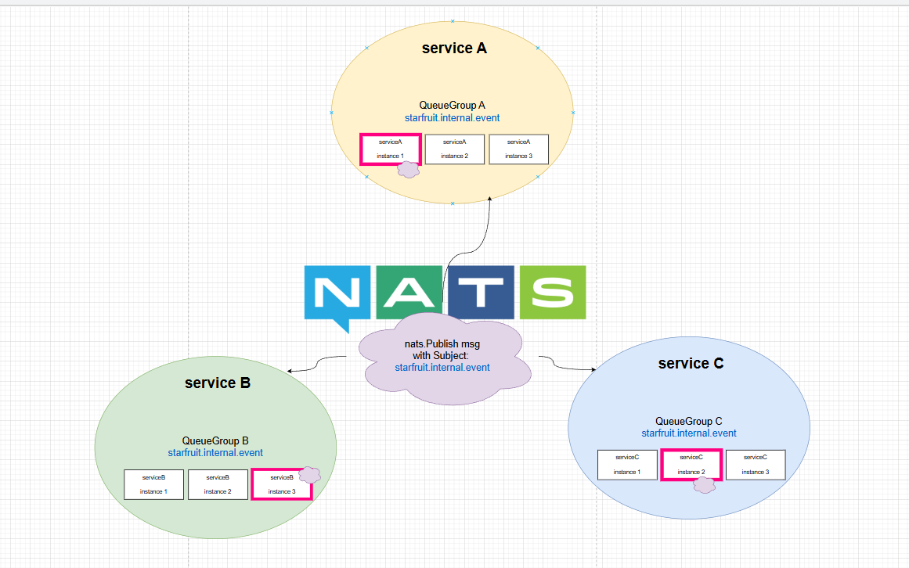

# Queue group with Nats Fanout

## description



하나의 subject(starfruit.internal.event)를 여러 개의 queue group이 구독하는 모델입니다.

3가지의 서비스가 있으며 각 서비스 별로 3개의 인스턴스가 있는 분산 환경 구성입니다.

각 서비스는 모두 공통의 nats Subejct를 구독하고 있어서 이벤트를 모든 서비스가 동시에 수신할 수 있지만,
nats queue group(QueueSubscribe)을 이루고 있기 때문에
이벤트 수신 시, 서비스 내에서 단 하나의 인스턴스만이 이벤트를 처리합니다.

## 적용 사례
* 특정 이벤트 발생 -> 이벤트에 대해서 여러 서비스에서 작업을 처리해주어야 하는 경우 해당 구조를 활용할 수 있습니다. 
* 여러 서비스에서 동시에 병렬적으로 작업을 처리를 할 수 있으며, 서비스 간의 비즈니스 로직 결합도를 낮출 수 있다는 장점이 있습니다.

* 예: 회원 가입 이벤트 발생하였을 때 해당 회원의 이메일로 가입 관련 내용을 전송해야 하고, 
회원 가입 내역을 로그로 남겨야 하는 경우, user.Signup subject를 여러 서비스에서 구독합니다. 
이메일 처리 서비스는 user.Signup subject로 된 메세지를 수신하여 이메일을 전송하면 되고
로그 서비스는  user.Signup subject로 된 메세지를 수신하여 DB에 해당 로그를 동시에 남기면 됩니다. 
* 단 분산환경을 고려했을 때, 이벤트를 수신한 각 서비스 인스턴스들 중 단 하나의 인스턴스만이 해당 이벤트를 수신하여 처리를 하도록 하려면, 각 서비스 인스턴스들은 subject에 대해 QueueSubscription을 해야합니다. 

** 따라서 이벤트 subject를 설계를 할때는, "**특정 서비스에서 어떤 역할을 하세요**" 라는 의미를 담은 명령형 이벤트가 아닌, "**사실 그 자체**"를 담도록 subject 네이밍을 해주세요. 
```
올바르지 못한 subject 예: user.requestSendEmail, user.recordLog (서비스간 비즈니스 로직 결합도 증가, 비즈니스 시나리오 변경 대비에 불리함)
올바른 subject 예: user.Signup
```

###  관련 문서

* 

* 

## 실행방법

```
# nats 서버 실행
docker-compose up -d

# poc 코드 실행
go run main.go
```

- [처리 완료] 로그에서 이벤트가 어떤 서비스의 어떤 인스턴스에 의해 처리가 되었는지 확인해 보세요
- 이벤트는 모든 서비스에 골고루 전달되어야 하지만, 각 서비스 내의 인스턴스 하나에만 전달되어 처리되는지 확인해 보세요

## 실행 결과 예시

```
PS C:\Users\User\Desktop\starfruit-nats-lab\queueGroup> go run .\main.go      
2025/11/05 09:45:46 --- NATS Queue Group POC start ---
2025/11/05 09:45:47 NATS 서버 연결 성공
2025/11/05 09:45:47 총 3개 서비스 (3개 큐 그룹), 각 서비스당 3개 인스턴스 실행 중...
2025/11/05 09:45:47 구독자: serviceA-1 큐 그룹: QueueGroupA consumeContext: &{{{} {0 0}} HX5fyVQr44cSIdFeCz8GUI 0xc0003b2000 0xc0003ba000 <nil> 0xc000384070 {500 0} 0xc0003a80c0 {{} 0} {{} 0} {{} 0} 0xc0003b6000 0xc0003b8000 0xc0003840e0 0xc0003b2080 0 <nil>}
2025/11/05 09:45:47 구독자: serviceA-3 큐 그룹: QueueGroupA consumeContext: &{{{} {0 0}} HX5fyVQr44cSIdFeCz8GWA 0xc0003b2100 0xc0003ba0f0 <nil> 0xc0003841c0 {500 0} 0xc0003a8190 {{} 0} {{} 0} {{} 0} 0xc0003b6070 0xc0003b80c0 0xc000384230 0xc0003b2180 0 <nil>}
2025/11/05 09:45:47 구독자: serviceC-1 큐 그룹: QueueGroupC consumeContext: &{{{} {0 0}} HX5fyVQr44cSIdFeCz8GYy 0xc00022e080 0xc000246000 <nil> 0xc0002202a0 {500 0} 0xc0002121f0 {{} 0} {{} 0} {{} 0} 0xc0002361c0 0xc000244000 0xc000220310 0xc00022e100 0 <nil>}
2025/11/05 09:45:47 구독자: serviceC-2 큐 그룹: QueueGroupC consumeContext: &{{{} {0 0}} HX5fyVQr44cSIdFeCz8GfW 0xc000032280 0xc0001b20f0 <nil> 0xc0001807e0 {500 0} 0xc0000263b0 {{} 0} {{} 0} {{} 0} 0xc00007c2a0 0xc0001e0000 0xc000180850 0xc000032300 0 <nil>}
2025/11/05 09:45:47 구독자: serviceB-3 큐 그룹: QueueGroupB consumeContext: &{{{} {0 0}} HX5fyVQr44cSIdFeCz8Gbm 0xc00022e180 0xc0002460f0 <nil> 0xc000220380 {500 0} 0xc000212250 {{} 0} {{} 0} {{} 0} 0xc000236230 0xc0002440c0 0xc0002203f0 0xc00022e200 0 <nil>}
2025/11/05 09:45:47 구독자: serviceB-2 큐 그룹: QueueGroupB consumeContext: &{{{} {0 0}} HX5fyVQr44cSIdFeCz8Gci 0xc00022e280 0xc0002461e0 <nil> 0xc000220460 {500 0} 0xc0002122b0 {{} 0} {{} 0} {{} 0} 0xc0002362a0 0xc000244180 0xc0002204d0 0xc00022e300 0 <nil>}
2025/11/05 09:45:47 구독자: serviceC-3 큐 그룹: QueueGroupC consumeContext: &{{{} {0 0}} HX5fyVQr44cSIdFeCz8Gaq 0xc0000f8800 0xc0002d6000 <nil> 0xc000115ab0 {500 0} 0xc00029a260 {{} 0} {{} 0} {{} 0} 0xc000088310 0xc000140000 0xc000115b20 0xc0000f8880 0 <nil>}
2025/11/05 09:45:47 구독자: serviceB-1 큐 그룹: QueueGroupB consumeContext: &{{{} {0 0}} HX5fyVQr44cSIdFeCz8GY2 0xc00030e080 0xc000332000 <nil> 0xc000328000 {500 0} 0xc0003120d0 {{} 0} {{} 0} {{} 0} 0xc00032c000 0xc000330000 0xc000328070 0xc00030e100 0 <nil>}
2025/11/05 09:45:47 구독자: serviceA-2 큐 그룹: QueueGroupA consumeContext: &{{{} {0 0}} HX5fyVQr44cSIdFeCz8Gde 0xc0002ac080 0xc0002462d0 <nil> 0xc0002a6380 {500 0} 0xc000212310 {{} 0} {{} 0} {{} 0} 0xc0002ae150 0xc0002d4000 0xc0002a63f0 0xc0002ac100 0 <nil>}
2025/11/05 09:45:48 
>>> 메시지 발행 시작: 15개 이벤트를 'starfruit.internal.event' 주제로 전송
2025/11/05 09:45:48 [처리 완료] Worker: serviceA-1 | Queue Group: QueueGroupA | Data: Event ID: E001 | Time: 60ms
2025/11/05 09:45:48 [처리 완료] Worker: serviceC-1 | Queue Group: QueueGroupC | Data: Event ID: E001 | Time: 60ms
2025/11/05 09:45:48 [처리 완료] Worker: serviceB-3 | Queue Group: QueueGroupB | Data: Event ID: E001 | Time: 64ms
2025/11/05 09:45:48 [처리 완료] Worker: serviceC-2 | Queue Group: QueueGroupC | Data: Event ID: E002 | Time: 62ms
2025/11/05 09:45:48 [처리 완료] Worker: serviceB-2 | Queue Group: QueueGroupB | Data: Event ID: E002 | Time: 62ms
2025/11/05 09:45:48 [처리 완료] Worker: serviceA-3 | Queue Group: QueueGroupA | Data: Event ID: E002 | Time: 64ms
2025/11/05 09:45:48 [처리 완료] Worker: serviceB-1 | Queue Group: QueueGroupB | Data: Event ID: E003 | Time: 60ms
2025/11/05 09:45:48 [처리 완료] Worker: serviceA-2 | Queue Group: QueueGroupA | Data: Event ID: E003 | Time: 62ms
2025/11/05 09:45:48 [처리 완료] Worker: serviceC-3 | Queue Group: QueueGroupC | Data: Event ID: E003 | Time: 64ms
2025/11/05 09:45:48 [처리 완료] Worker: serviceC-1 | Queue Group: QueueGroupC | Data: Event ID: E004 | Time: 60ms
2025/11/05 09:45:48 [처리 완료] Worker: serviceA-1 | Queue Group: QueueGroupA | Data: Event ID: E004 | Time: 60ms
2025/11/05 09:45:48 [처리 완료] Worker: serviceB-3 | Queue Group: QueueGroupB | Data: Event ID: E004 | Time: 64ms
2025/11/05 09:45:48 [처리 완료] Worker: serviceB-2 | Queue Group: QueueGroupB | Data: Event ID: E005 | Time: 62ms
2025/11/05 09:45:48 [처리 완료] Worker: serviceC-2 | Queue Group: QueueGroupC | Data: Event ID: E005 | Time: 62ms
2025/11/05 09:45:48 [처리 완료] Worker: serviceA-3 | Queue Group: QueueGroupA | Data: Event ID: E005 | Time: 64ms
2025/11/05 09:45:48 [처리 완료] Worker: serviceB-1 | Queue Group: QueueGroupB | Data: Event ID: E006 | Time: 60ms
2025/11/05 09:45:48 [처리 완료] Worker: serviceA-2 | Queue Group: QueueGroupA | Data: Event ID: E006 | Time: 62ms
2025/11/05 09:45:48 [처리 완료] Worker: serviceC-3 | Queue Group: QueueGroupC | Data: Event ID: E006 | Time: 64ms
2025/11/05 09:45:48 [처리 완료] Worker: serviceC-1 | Queue Group: QueueGroupC | Data: Event ID: E007 | Time: 60ms
2025/11/05 09:45:48 [처리 완료] Worker: serviceA-1 | Queue Group: QueueGroupA | Data: Event ID: E007 | Time: 60ms
2025/11/05 09:45:48 [처리 완료] Worker: serviceB-3 | Queue Group: QueueGroupB | Data: Event ID: E007 | Time: 64ms
2025/11/05 09:45:48 [처리 완료] Worker: serviceB-2 | Queue Group: QueueGroupB | Data: Event ID: E008 | Time: 62ms
2025/11/05 09:45:48 [처리 완료] Worker: serviceC-2 | Queue Group: QueueGroupC | Data: Event ID: E008 | Time: 62ms
2025/11/05 09:45:48 [처리 완료] Worker: serviceA-3 | Queue Group: QueueGroupA | Data: Event ID: E008 | Time: 64ms
2025/11/05 09:45:48 [처리 완료] Worker: serviceB-1 | Queue Group: QueueGroupB | Data: Event ID: E009 | Time: 60ms
2025/11/05 09:45:48 [처리 완료] Worker: serviceA-2 | Queue Group: QueueGroupA | Data: Event ID: E009 | Time: 62ms
2025/11/05 09:45:48 [처리 완료] Worker: serviceC-3 | Queue Group: QueueGroupC | Data: Event ID: E009 | Time: 64ms
2025/11/05 09:45:48 [처리 완료] Worker: serviceC-1 | Queue Group: QueueGroupC | Data: Event ID: E010 | Time: 60ms
2025/11/05 09:45:48 [처리 완료] Worker: serviceA-1 | Queue Group: QueueGroupA | Data: Event ID: E010 | Time: 60ms
2025/11/05 09:45:48 [처리 완료] Worker: serviceB-3 | Queue Group: QueueGroupB | Data: Event ID: E010 | Time: 64ms
2025/11/05 09:45:48 [처리 완료] Worker: serviceC-2 | Queue Group: QueueGroupC | Data: Event ID: E011 | Time: 62ms
2025/11/05 09:45:48 [처리 완료] Worker: serviceB-2 | Queue Group: QueueGroupB | Data: Event ID: E011 | Time: 62ms
2025/11/05 09:45:48 [처리 완료] Worker: serviceA-3 | Queue Group: QueueGroupA | Data: Event ID: E011 | Time: 64ms
2025/11/05 09:45:48 [처리 완료] Worker: serviceA-3 | Queue Group: QueueGroupA | Data: Event ID: E005 | Time: 64ms
2025/11/05 09:45:48 [처리 완료] Worker: serviceB-1 | Queue Group: QueueGroupB | Data: Event ID: E006 | Time: 60ms
2025/11/05 09:45:48 [처리 완료] Worker: serviceA-2 | Queue Group: QueueGroupA | Data: Event ID: E006 | Time: 62ms
2025/11/05 09:45:48 [처리 완료] Worker: serviceC-3 | Queue Group: QueueGroupC | Data: Event ID: E006 | Time: 64ms
2025/11/05 09:45:48 [처리 완료] Worker: serviceC-1 | Queue Group: QueueGroupC | Data: Event ID: E007 | Time: 60ms
2025/11/05 09:45:48 [처리 완료] Worker: serviceA-1 | Queue Group: QueueGroupA | Data: Event ID: E007 | Time: 60ms
2025/11/05 09:45:48 [처리 완료] Worker: serviceB-3 | Queue Group: QueueGroupB | Data: Event ID: E007 | Time: 64ms
2025/11/05 09:45:48 [처리 완료] Worker: serviceB-2 | Queue Group: QueueGroupB | Data: Event ID: E008 | Time: 62ms
2025/11/05 09:45:48 [처리 완료] Worker: serviceC-2 | Queue Group: QueueGroupC | Data: Event ID: E008 | Time: 62ms
2025/11/05 09:45:48 [처리 완료] Worker: serviceA-3 | Queue Group: QueueGroupA | Data: Event ID: E008 | Time: 64ms
2025/11/05 09:45:48 [처리 완료] Worker: serviceB-1 | Queue Group: QueueGroupB | Data: Event ID: E009 | Time: 60ms
2025/11/05 09:45:48 [처리 완료] Worker: serviceA-2 | Queue Group: QueueGroupA | Data: Event ID: E009 | Time: 62ms
2025/11/05 09:45:48 [처리 완료] Worker: serviceC-3 | Queue Group: QueueGroupC | Data: Event ID: E009 | Time: 64ms
2025/11/05 09:45:48 [처리 완료] Worker: serviceC-1 | Queue Group: QueueGroupC | Data: Event ID: E010 | Time: 60ms
2025/11/05 09:45:48 [처리 완료] Worker: serviceA-1 | Queue Group: QueueGroupA | Data: Event ID: E010 | Time: 60ms
2025/11/05 09:45:48 [처리 완료] Worker: serviceB-3 | Queue Group: QueueGroupB | Data: Event ID: E010 | Time: 64ms
2025/11/05 09:45:48 [처리 완료] Worker: serviceC-2 | Queue Group: QueueGroupC | Data: Event ID: E011 | Time: 62ms
2025/11/05 09:45:48 [처리 완료] Worker: serviceB-2 | Queue Group: QueueGroupB | Data: Event ID: E011 | Time: 62ms
2025/11/05 09:45:48 [처리 완료] Worker: serviceA-3 | Queue Group: QueueGroupA | Data: Event ID: E011 | Time: 64ms
2025/11/05 09:45:48 [처리 완료] Worker: serviceB-1 | Queue Group: QueueGroupB | Data: Event ID: E006 | Time: 60ms
2025/11/05 09:45:48 [처리 완료] Worker: serviceA-2 | Queue Group: QueueGroupA | Data: Event ID: E006 | Time: 62ms
2025/11/05 09:45:48 [처리 완료] Worker: serviceC-3 | Queue Group: QueueGroupC | Data: Event ID: E006 | Time: 64ms
2025/11/05 09:45:48 [처리 완료] Worker: serviceC-1 | Queue Group: QueueGroupC | Data: Event ID: E007 | Time: 60ms
2025/11/05 09:45:48 [처리 완료] Worker: serviceA-1 | Queue Group: QueueGroupA | Data: Event ID: E007 | Time: 60ms
2025/11/05 09:45:48 [처리 완료] Worker: serviceB-3 | Queue Group: QueueGroupB | Data: Event ID: E007 | Time: 64ms
2025/11/05 09:45:48 [처리 완료] Worker: serviceB-2 | Queue Group: QueueGroupB | Data: Event ID: E008 | Time: 62ms
2025/11/05 09:45:48 [처리 완료] Worker: serviceC-2 | Queue Group: QueueGroupC | Data: Event ID: E008 | Time: 62ms
2025/11/05 09:45:48 [처리 완료] Worker: serviceA-3 | Queue Group: QueueGroupA | Data: Event ID: E008 | Time: 64ms
2025/11/05 09:45:48 [처리 완료] Worker: serviceB-1 | Queue Group: QueueGroupB | Data: Event ID: E009 | Time: 60ms
2025/11/05 09:45:48 [처리 완료] Worker: serviceA-2 | Queue Group: QueueGroupA | Data: Event ID: E009 | Time: 62ms
2025/11/05 09:45:48 [처리 완료] Worker: serviceC-3 | Queue Group: QueueGroupC | Data: Event ID: E009 | Time: 64ms
2025/11/05 09:45:48 [처리 완료] Worker: serviceC-1 | Queue Group: QueueGroupC | Data: Event ID: E010 | Time: 60ms
2025/11/05 09:45:48 [처리 완료] Worker: serviceA-1 | Queue Group: QueueGroupA | Data: Event ID: E010 | Time: 60ms
2025/11/05 09:45:48 [처리 완료] Worker: serviceB-3 | Queue Group: QueueGroupB | Data: Event ID: E010 | Time: 64ms
2025/11/05 09:45:48 [처리 완료] Worker: serviceC-2 | Queue Group: QueueGroupC | Data: Event ID: E011 | Time: 62ms
2025/11/05 09:45:48 [처리 완료] Worker: serviceB-2 | Queue Group: QueueGroupB | Data: Event ID: E011 | Time: 62ms
2025/11/05 09:45:48 [처리 완료] Worker: serviceA-3 | Queue Group: QueueGroupA | Data: Event ID: E011 | Time: 64ms
2025/11/05 09:45:48 [처리 완료] Worker: serviceA-1 | Queue Group: QueueGroupA | Data: Event ID: E007 | Time: 60ms
2025/11/05 09:45:48 [처리 완료] Worker: serviceB-3 | Queue Group: QueueGroupB | Data: Event ID: E007 | Time: 64ms
2025/11/05 09:45:48 [처리 완료] Worker: serviceB-2 | Queue Group: QueueGroupB | Data: Event ID: E008 | Time: 62ms
2025/11/05 09:45:48 [처리 완료] Worker: serviceC-2 | Queue Group: QueueGroupC | Data: Event ID: E008 | Time: 62ms
2025/11/05 09:45:48 [처리 완료] Worker: serviceA-3 | Queue Group: QueueGroupA | Data: Event ID: E008 | Time: 64ms
2025/11/05 09:45:48 [처리 완료] Worker: serviceB-1 | Queue Group: QueueGroupB | Data: Event ID: E009 | Time: 60ms
2025/11/05 09:45:48 [처리 완료] Worker: serviceA-2 | Queue Group: QueueGroupA | Data: Event ID: E009 | Time: 62ms
2025/11/05 09:45:48 [처리 완료] Worker: serviceC-3 | Queue Group: QueueGroupC | Data: Event ID: E009 | Time: 64ms
2025/11/05 09:45:48 [처리 완료] Worker: serviceC-1 | Queue Group: QueueGroupC | Data: Event ID: E010 | Time: 60ms
2025/11/05 09:45:48 [처리 완료] Worker: serviceA-1 | Queue Group: QueueGroupA | Data: Event ID: E010 | Time: 60ms
2025/11/05 09:45:48 [처리 완료] Worker: serviceB-3 | Queue Group: QueueGroupB | Data: Event ID: E010 | Time: 64ms
2025/11/05 09:45:48 [처리 완료] Worker: serviceC-2 | Queue Group: QueueGroupC | Data: Event ID: E011 | Time: 62ms
2025/11/05 09:45:48 [처리 완료] Worker: serviceB-2 | Queue Group: QueueGroupB | Data: Event ID: E011 | Time: 62ms
2025/11/05 09:45:48 [처리 완료] Worker: serviceA-3 | Queue Group: QueueGroupA | Data: Event ID: E011 | Time: 64ms
2025/11/05 09:45:48 [처리 완료] Worker: serviceC-2 | Queue Group: QueueGroupC | Data: Event ID: E008 | Time: 62ms
2025/11/05 09:45:48 [처리 완료] Worker: serviceA-3 | Queue Group: QueueGroupA | Data: Event ID: E008 | Time: 64ms
2025/11/05 09:45:48 [처리 완료] Worker: serviceB-1 | Queue Group: QueueGroupB | Data: Event ID: E009 | Time: 60ms
2025/11/05 09:45:48 [처리 완료] Worker: serviceA-2 | Queue Group: QueueGroupA | Data: Event ID: E009 | Time: 62ms
2025/11/05 09:45:48 [처리 완료] Worker: serviceC-3 | Queue Group: QueueGroupC | Data: Event ID: E009 | Time: 64ms
2025/11/05 09:45:48 [처리 완료] Worker: serviceC-1 | Queue Group: QueueGroupC | Data: Event ID: E010 | Time: 60ms
2025/11/05 09:45:48 [처리 완료] Worker: serviceA-1 | Queue Group: QueueGroupA | Data: Event ID: E010 | Time: 60ms
2025/11/05 09:45:48 [처리 완료] Worker: serviceB-3 | Queue Group: QueueGroupB | Data: Event ID: E010 | Time: 64ms
2025/11/05 09:45:48 [처리 완료] Worker: serviceC-2 | Queue Group: QueueGroupC | Data: Event ID: E011 | Time: 62ms
2025/11/05 09:45:48 [처리 완료] Worker: serviceB-2 | Queue Group: QueueGroupB | Data: Event ID: E011 | Time: 62ms
2025/11/05 09:45:48 [처리 완료] Worker: serviceA-3 | Queue Group: QueueGroupA | Data: Event ID: E011 | Time: 64ms
2025/11/05 09:45:48 [처리 완료] Worker: serviceA-2 | Queue Group: QueueGroupA | Data: Event ID: E009 | Time: 62ms
2025/11/05 09:45:48 [처리 완료] Worker: serviceC-3 | Queue Group: QueueGroupC | Data: Event ID: E009 | Time: 64ms
2025/11/05 09:45:48 [처리 완료] Worker: serviceC-1 | Queue Group: QueueGroupC | Data: Event ID: E010 | Time: 60ms
2025/11/05 09:45:48 [처리 완료] Worker: serviceA-1 | Queue Group: QueueGroupA | Data: Event ID: E010 | Time: 60ms
2025/11/05 09:45:48 [처리 완료] Worker: serviceB-3 | Queue Group: QueueGroupB | Data: Event ID: E010 | Time: 64ms
2025/11/05 09:45:48 [처리 완료] Worker: serviceC-2 | Queue Group: QueueGroupC | Data: Event ID: E011 | Time: 62ms
2025/11/05 09:45:48 [처리 완료] Worker: serviceB-2 | Queue Group: QueueGroupB | Data: Event ID: E011 | Time: 62ms
2025/11/05 09:45:48 [처리 완료] Worker: serviceA-3 | Queue Group: QueueGroupA | Data: Event ID: E011 | Time: 64ms
2025/11/05 09:45:48 [처리 완료] Worker: serviceA-1 | Queue Group: QueueGroupA | Data: Event ID: E010 | Time: 60ms
2025/11/05 09:45:48 [처리 완료] Worker: serviceB-3 | Queue Group: QueueGroupB | Data: Event ID: E010 | Time: 64ms
2025/11/05 09:45:48 [처리 완료] Worker: serviceC-2 | Queue Group: QueueGroupC | Data: Event ID: E011 | Time: 62ms
2025/11/05 09:45:48 [처리 완료] Worker: serviceB-2 | Queue Group: QueueGroupB | Data: Event ID: E011 | Time: 62ms
2025/11/05 09:45:48 [처리 완료] Worker: serviceA-3 | Queue Group: QueueGroupA | Data: Event ID: E011 | Time: 64ms
2025/11/05 09:45:48 [처리 완료] Worker: serviceB-2 | Queue Group: QueueGroupB | Data: Event ID: E011 | Time: 62ms
2025/11/05 09:45:48 [처리 완료] Worker: serviceA-3 | Queue Group: QueueGroupA | Data: Event ID: E011 | Time: 64ms
2025/11/05 09:45:48 [처리 완료] Worker: serviceB-1 | Queue Group: QueueGroupB | Data: Event ID: E012 | Time: 60ms
2025/11/05 09:45:48 [처리 완료] Worker: serviceA-2 | Queue Group: QueueGroupA | Data: Event ID: E012 | Time: 62ms
2025/11/05 09:45:48 [처리 완료] Worker: serviceC-3 | Queue Group: QueueGroupC | Data: Event ID: E012 | Time: 64ms
2025/11/05 09:45:48 [처리 완료] Worker: serviceC-1 | Queue Group: QueueGroupC | Data: Event ID: E013 | Time: 60ms
2025/11/05 09:45:48 [처리 완료] Worker: serviceA-1 | Queue Group: QueueGroupA | Data: Event ID: E013 | Time: 60ms
2025/11/05 09:45:48 [처리 완료] Worker: serviceB-3 | Queue Group: QueueGroupB | Data: Event ID: E013 | Time: 64ms
2025/11/05 09:45:48 [처리 완료] Worker: serviceB-2 | Queue Group: QueueGroupB | Data: Event ID: E014 | Time: 62ms
2025/11/05 09:45:48 [처리 완료] Worker: serviceC-2 | Queue Group: QueueGroupC | Data: Event ID: E014 | Time: 62ms
2025/11/05 09:45:48 [처리 완료] Worker: serviceA-3 | Queue Group: QueueGroupA | Data: Event ID: E014 | Time: 64ms
2025/11/05 09:45:48 <<< 메시지 발행 완료
2025/11/05 09:45:48 [처리 완료] Worker: serviceB-1 | Queue Group: QueueGroupB | Data: Event ID: E015 | Time: 60ms
2025/11/05 09:45:48 [처리 완료] Worker: serviceA-2 | Queue Group: QueueGroupA | Data: Event ID: E015 | Time: 62ms
2025/11/05 09:45:48 [처리 완료] Worker: serviceC-3 | Queue Group: QueueGroupC | Data: Event ID: E015 | Time: 64ms
2025/11/05 09:45:48
--- POC 종료 (총 45개 작업 완료) ---
```
