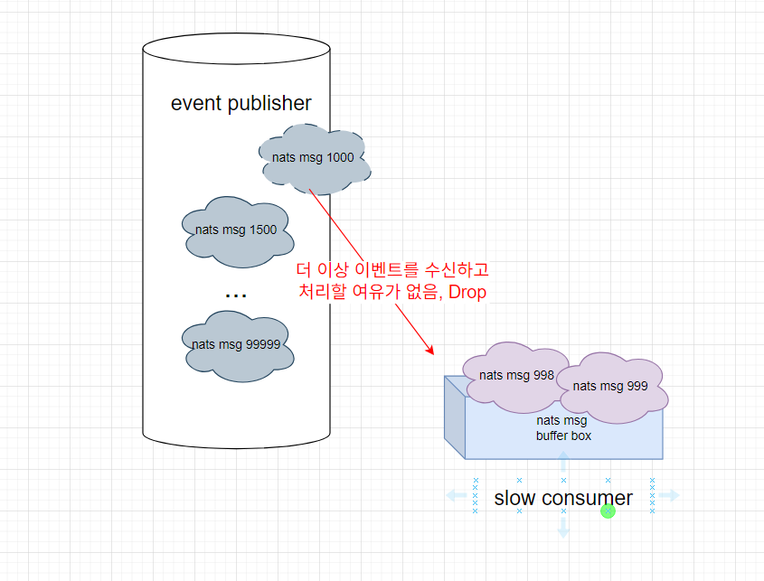

# Slow consumer

## description



메세지 발행자보다 소비자가 msg를 처리하는 속도가 느린 경우 이를 slow consumer라고 하며
nats Server에서는 이 소비자에게 msg를 더 보내지 않고 drop 합니다.
덧붙여서 nats server와 주고받는 ping pong에 제때 응답을 하지 않은 경우 연결이 끊어집니다.

예제 코드에서 발행자는 소비자보다 100배 더 빠른 속도로 메세지를 발행하며,
소비자는 최대 10개까지만 메세지를 pending 하도록 설정되어 있습니다.

## 실행방법

```
# nats 서버 실행
docker-compose up -d

# poc 코드 실행
go run main.go
```

덧붙여 81번째 줄을 주석 해제해서, slow consumer가 해제되는 것도 확인해보세요

## 실행 결과 예시

아래와 같이 메세지 수신 [] 번호가 1씩 연속적으로 증가하지 않는다는 것을 통해 중간에 일부 메세지가 유실됨을 확인할수있습니다.

```
PS C:\Users\User\Desktop\starfruit-nats-lab\slowConsumer> go run .\main.go
2025/11/04 18:50:05.701848 NATS에 연결되었습니다: nats://127.0.0.1:4222
2025/11/04 18:50:05.720466 구독 시작. 이제 publisher를 실행하여 메시지를 보내세요. slow-group
...(중략)...
Falling behind with 10 pending messages on subject "orders.create".
2025/11/04 18:54:35.744371 메시지 수신 [4351] - 처리 완료
2025/11/04 18:54:35.744371 메시지 수신 [4450] - 처리 시작
natsErrHandler error: nats: slow consumer, messages dropped
Falling behind with 10 pending messages on subject "orders.create".
2025/11/04 18:54:40.744629 메시지 수신 [4450] - 처리 완료
2025/11/04 18:54:40.744629 메시지 수신 [4549] - 처리 시작
natsErrHandler error: nats: slow consumer, messages dropped
Falling behind with 10 pending messages on subject "orders.create".
2025/11/04 18:54:45.744938 메시지 수신 [4549] - 처리 완료
2025/11/04 18:54:45.744938 메시지 수신 [4648] - 처리 시작
natsErrHandler error: nats: slow consumer, messages dropped
Falling behind with 10 pending messages on subject "orders.create".
```

## Slow consumer 로그 확인 방법

### 클라이언트

연결할 떄 connection option으로써 errorHandler 함수를 선언합니다.

```
func natsErrHandler(nc *nats.Conn, sub *nats.Subscription, natsErr error) {
	fmt.Printf("natsErrHandler error: %v\n", natsErr)
	if natsErr == nats.ErrSlowConsumer {
		pendingMsgs, _, err := sub.Pending()
		if err != nil {
			fmt.Printf("처리하지 못하고 버퍼에 쌓여있는 메세지 수 확인 오류: %v", err)
			return
		}
		fmt.Printf("%d개의 메세지가 subject %s에 대해 처리되지 못하고 버퍼에 쌓여있음\n", pendingMsgs, sub.Subject)
		// Log error, notify operations...

	}
	// check for other errors
}

//
nc, err := nats.Connect("nats://localhost:4222",
  nats.ErrorHandler(natsErrHandler))
```

### 서버

slow consumer가 감지되면, 서버에 아래와 같은 로그가 보입니다.

```
[54083] 2017/09/28 14:45:18.001357 [INF] ::1:63283 - cid:7 - Slow Consumer Detected
```

## Slow Consumer 해결 방법

1. 구독하는 Subject를 구체화합니다

- 와일드카드 토큰(\*, >) 대신, 구체적인 token을 사용해서 받아들이는 메세지의 수를 줄여봅니다.

- 예를 들어 포괄적인 Sensors.> 같은 subject 보다는 Sensors.South, Sensors.North 와 같이 구체적인 subject를 구독하도록 하여 부하를 분산시킬 수 있어요.

2. consumer의 maxPendingMsgs, maxPendingBytes 설정을 늘려봅니다.

- 이 옵션은 subscription 설정에서 할 수 있습니다

```
	sub, err := nc.InternalConn.QueueSubscribe(
		subject,
		nc.Env.NATS_INTERNAL_PUB_QUEUE,
		result.handleInternalEventMessage,
	)
	if err != nil {
		return nil, errutil.WrapWithStack(err)
	}

    //여기서 설정해 주세요
	if err := sub.SetPendingLimits(nc.Env.NATS_INTERNAL_EVENT_MAX_PENDING_MSGS, nc.Env.NATS_INTERNAL_EVENT_MAX_PENDING_BYTES); err != nil {
		return nil, errutil.WrapWithStack(err)
	}
```

3. slow consumer 에러를 로깅하는 방법도 권장합니다

- nats connection 옵션에 다음을 추가해주세요.

```
 option := []nats.Option{
    nats.DisconnectHandler(func(nc *nats.Conn) {
			log.Printf("🚨 연결 끊김 감지! 최종 에러: %v", nc.LastError())
		}),
    nats.ReconnectHandler(func(nc *nats.Conn) {
        log.Println("✅ 연결 복구 성공! - 재연결 시 사용한 url: ", nc.ConnectedUrl())
    }),
    nats.MaxReconnects(5),
    nats.ErrorHandler(natsErrHandler),
 }

func natsErrHandler(nc *nats.Conn, sub *nats.Subscription, natsErr error) {
	fmt.Printf("natsErrHandler error: %v\n", natsErr)
	if natsErr == nats.ErrSlowConsumer {
		pendingMsgs, _, err := sub.Pending()
		if err != nil {
			fmt.Printf("처리하지 못하고 버퍼에 쌓여있는 메세지 수 확인 오류: %v", err)
			return
		}
		fmt.Printf("%d개의 메세지가 subject %s에 대해 처리되지 못하고 버퍼에 쌓여있음\n", pendingMsgs, sub.Subject)
		// Log error, notify operations...

	}
	// check for other errors
}


```

## references

https://docs.nats.io/running-a-nats-service/nats_admin/slow_consumers
